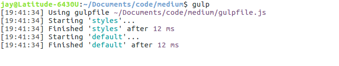

#Writing Modular JavaScript  -  Pt 3

This is the third and final part in an introductory series on writing modular JavaScript applications. [Part 1](https://medium.com/@jrschwane/writing-modular-javascript-pt-1-b42a3bd23685) explained why modularity is desirable and presented a modular application design structure. In [part 2](https://medium.com/@jrschwane/writing-modular-javascript-pt-2-d7140d15c982), we built a simple application based on those principles. We will conclude the series by preparing our project for deployment.


###Introduction

We ended part 2 with a working modular web application.  We wrote our modules and stylesheets as separate files, linked together through our `index.html` and bootstrapped by our `app.js`. This is an efficient and scalable development process for all the reasons discussed in the part 1 of the series.

But it's a process that produced eight separate files. Our browser has to open and maintain eight separate http requests to retrieve each of those files, and that's before we include the hosted font or jQuery. Although our files are not large and modern browsers can make these requests in parallel, in a large application the cumulative latency of those requests would result in slower page loads. We can reduce the number of http requests through [concatenatation](https://en.wikipedia.org/wiki/Concatenation).

We can also increase performance through [minification](https://en.wikipedia.org/wiki/Minification_(programming)), a kind of compression where our function and variable names are replaced with smaller "tokens", and all comments, white space and line breaks are removed. This results in smaller file sizes, which means quicker page loads for users.

Our demo application includes a feature of es6/es2015: [template literals](https://developer.mozilla.org/en-US/docs/Web/JavaScript/Reference/Template_literals). Template literals are amazingly useful, but their backtick delimiters cause problems for some code minifiers. Furthermore, not every browser supports es6/es2015 syntax. So we want to [transpile](https://en.wikipedia.org/wiki/Source-to-source_compiler) our source code into traditional _every-browser-understands-it_ es5 JavaScript.

Finally, imagine that we composed our stylesheets with SASS instead of CSS. Browsers do not natively understand SASS, we want to convert that into regular CSS. We won’t actually rewrite our stylesheets — instead we’ll cheat a little for demonstration purposes. And while we’re at it, we want to add all necessary vendor-prefixed selectors so different browsers behave as expected.

That's a lengthly wish list.  In this article we will use [Gulp](http://gulpjs.com/) to provide solutions to each of the above "wants". Gulp will process our source files and create new production-ready files that we can use when deploying our application.

Although our demo is a _front-end_ application, because Gulp depends on [Node.js](https://nodejs.org/en/) - typically used in _back-end_ applications - the reader should have basic familiarity with Node and [NPM](https://www.npmjs.com/) and have them installed locally. If you do not, please refer to the [official docs](https://nodejs.org/en/download/package-manager/) for installation instructions. And if you would like to learn more, [Scotch.io](https://scotch.io/tag/node-js) has excellent Node.js resources.

Aside from a few Node-specific functions (`require` and `pipe`), the rest of our code will use regular es5 JavaScript. We will spend a bit of time in the command line, but you needn't be a CLI ninja.

###Application Structure

Part 2 left us with the following file/folder structure:

```
|-- /src
|    |
|    |-- /css
|    |    |
|    |    |-- app.css
|    |    |-- background.css
|    |    |-- greeting.css
|    |    |-- quote.css
|    |
|    |-- /js
|         |
|         |-- app.js
|         |-- background.js
|         |-- greeting.js
|         |-- quote.js
|
| index.html
```

We will work mainly in the root of our project folder; Gulp will be working on all those `/src` files.

###Initialization

Begin by initializing a new project with NPM. While in our project’s root directory, issue the following terminal command:

`npm init -y`

>If you omit the `-y` flag, NPM will ask you a series of questions about your project. `-y` just tells NPM to accept all the default answers. `npm init` creates a new `package.json` file in your project's root directory, populated with the answers to `npm init`'s questions.

###Gulp

Gulp is a Node.js _task runner_ - it runs tasks that we will later write. But by itself, Gulp cannot satisfy the 'wants' we itemized in the introduction. To do so, we first need to install some plug-ins to give Gulp new abilities.

But before that, we need to install Gulp. Gulp runs in the command line and installs using NPM. There are three parts to its installation: install Gulp globally, then install the local project package, and finally install any needed plugins.

>You may need elevated priviledges to instal Gulp globally. You'll know if your installation attempt errors out! In a Debian/Ubuntu environment you need to preface the installation command with `sudo`. Elevated privileges are not required to install the _local_ Gulp package or any of the plugins we need.

Install the global Gulp package using the following command (`sudo` as needed):

`npm install gulp-cli -g`

Once that has finished, install Gulp locally. Make sure you are still in your demo project's root folder, and issue the following command:

`npm install gulp --save-dev`

The `--save-dev` command-line switch registers the package as a _developer dependency_ in `package.json`.  If you open `package.json` now, you'll see that it has a new `"devDependencies" : {...}` property listing "gulp" as its sole dependency. All our various plugins will be registered here after we install them.  Let's do that now.

We need the following plugins:

1.  [gulp-concat](https://www.npmjs.com/package/gulp-concat) - to concatenate (merge together) our separate JavaScript and SASS files

2.  [gulp-sass](https://www.npmjs.com/package/gulp-sass) - to convert SASS files into traditional `.css` files

3.  [gulp-autoprefixer](https://www.npmjs.com/package/gulp-autoprefixer) - to automatically add vendor-prefixed selectors to our stylesheets based on [CanIUse](http://caniuse.com/) rules

4.  [gulp-babel](https://www.npmjs.com/package/gulp-babel) - to transpile any es6 syntax into traditional es5 JavaScript using Babel

5.  [babel-preset-es2015](https://www.npmjs.com/package/babel-preset-es2015) - a preset Babel configuration

6.  [gulp-sourcemaps](https://www.npmjs.com/package/gulp-sourcemaps) - to generate a JavaScript [sourcemap](https://www.html5rocks.com/en/tutorials/developertools/sourcemaps/) so that when we're debugging we can make sense of our browser's console output

7.  [gulp-uglify](https://www.npmjs.com/package/gulp-uglify) - to minify our JavaScript

We install these plugins using NPM, again using the `--save-dev` switch to add each module to `package.json`. You can install each individually or all at once:

`npm install gulp-concat gulp-sass gulp-autoprefixer gulp-babel babel-preset-es2015 gulp-sourcemaps gulp-uglify --save-dev`

You may have noticed the new `node_modules` folder that was created in your project’s root directory. NPM stores everything required by our dependencies in there. We will not need to touch anything in `node_modules`.

>If you use Git for version control, now would be a good time to add `node_modules/` to your `.gitignore` file. There's no reason for us to track or push those files to a remote repository. Should they be deleted, we can easily recreate them with a single `npm install` command.

Our `"devDependencies"` object should now look like this (version numbers current as of publication date):

```javascript
"devDependencies": {
    "babel-preset-es2015": "^6.22.0",
    "gulp": "^3.9.1",
    "gulp-autoprefixer": "^3.1.1",
    "gulp-babel": "^6.1.2",
    "gulp-concat": "^2.6.1",
    "gulp-sass": "^3.1.0",
    "gulp-sourcemaps": "^2.4.1",
    "gulp-uglify": "^2.1.0"
}
```

Gulp has everything it needs to process our JavaScript and SASS files. Before we can start writing tasks, we have to create a **gulpfile** to contain them.  Create a new `gulpfile.js` in your root project directory and begin by importing our plugin modules:

```javascript
/* gulpfile.js */

var gulp         = require('gulp'),
    concat       = require('gulp-concat'),
    sass         = require('gulp-sass'),
    autoprefixer = require('gulp-autoprefixer'),
    sourcemaps   = require('gulp-sourcemaps'),
    uglify       = require('gulp-uglify'),
    babel        = require('gulp-babel');
```

We'll add our tasks below the module assignment above.

###Processing CSS

We want Gulp to process our separate stylesheets, convert SASS to CSS, add any necessary vendor-prefixed selectors and output the result as a single file. But wait - we don't actually have any SASS. Lucky for us, traditional CSS is also valid SASS, so we can fake it by just renaming our file extensions. In our project's `/src/css/` folder, rename all the `.css` files to `.scss`:

```
|-- /src
|    |
|    |-- /css
|    |    |
|    |    |-- app.scss
|    |    |-- background.scss
|    |    |-- greeting.scss
|    |    |-- quote.scss
```

_Et voilà: SASS!_

We're _finally_ ready to write our first Gulp task. Gulp tasks are methods that take two arguments: the task’s name (as a string) and an anonymous callback function:

```javascript
// example
gulp.task('taskName', function () {

    // do stuff

});
```

Create a `styles` task in our `gulpfile.js` after the module assignments:

```javascript
/* gulpfile.js */

var gulp         = require('gulp'),
    concat       = require('gulp-concat'),
    sass         = require('gulp-sass'),
    autoprefixer = require('gulp-autoprefixer'),
    sourcemaps   = require('gulp-sourcemaps'),
    uglify       = require('gulp-uglify'),
    babel        = require('gulp-babel');
    

// process stylesheets
gulp.task('styles', function () {

    gulp.src('src/css/**/*.scss')
        .pipe(concat('quote-app.scss'))
        .pipe(sass().on('error', sass.logError))
        .pipe(autoprefixer({
            browsers: ['last 2 versions']  // config object
        }))
        .pipe(gulp.dest('dist/css'));

});
```

Inside the callback, we first give `gulp.src()` the location of our `.scss` files.  The strange-looking wildcard `/**/` instructs Gulp to look for matching files in `/src/css` _and its subfolders_.  This is especially handy if you elected to organize your project folders _by feature_. Then we `.pipe()` those source files through each of our plugins (the arguments passed to each subsequent `.pipe()`), processing them along the way:

1.  The separate `.scss` source files are first concatenated into a single `quote-app.scss` file
2.  that file is then converted to a standard `.css` file
3.  then vendor-prefixed selectors are added based on the config object (ours targets the two most-recent browser versions)
4.  finally, the processed CSS file is written to `/dist/css/` (Gulp will create folders if they don't already exist)

Task #1: _done_. Run it from your terminal: `gulp styles`


Gulp created new file `/dist/css/quote-app.css` - take a look at it in your editor. All of our separate `.scss` files were merged, converted to `.css` and vendor-prefixed (specifically the _flexbox_ properties):


In `index.html`, we can now replace the four separate links to our original `/src/css/` files with a single `<link>` to our new `/dist/css/quote-app.css`:

```html
<!-- ===================== css ====================== -->
<link rel="stylesheet" href="dist/css/quote-app.css">
```

If you make changes to your source `/src/css` files, those changes will not propagate to the production `/dist/css/quote-app.css` until you re-run `gulp styles`.  That's annoying; we'll learn how to automate this process after dealing with our JavaScript.

###Processing JavaScript

Before we write the task to process our JavaScript files, we need to mention a potential issue. In the preceding section we used `gulp.src('src/css/**/*.scss')` to grab any SASS files found in `src/css` and its subfolders. Gulp grabs them irrespective of their order. That's not necessarily a problem with SASS/CSS, especially since we namespaced our selectors. But order is critical with our JavaScript - **our modules need to be initialized first** so that their public methods exist to be called by `app.js`.

We can enforce a specific file order by passing an array to `gulp.src()` consisting of our source file names. Create the new array below our imported modules:

```javascript
/* gulpfile.js */

var gulp         = require('gulp'),
    concat       = require('gulp-concat'),
    sass         = require('gulp-sass'),
    autoprefixer = require('gulp-autoprefixer'),
    sourcemaps   = require('gulp-sourcemaps'),
    uglify       = require('gulp-uglify'),
    babel        = require('gulp-babel');


// ordered array of javascript source files
var sourceJS = [
    'src/js/background.js',
    'src/js/greeting.js',
    'src/js/quote.js',
    'src/js/app.js'        // must come last!
];    
```

Now add a `scripts` task after our existing `styles` task:

```javascript
/* gulpfile.js */

/* ... snip ... */

// process scripts
gulp.task('scripts', function () {

    gulp.src(sourceJS)           // <-- our new array
        .pipe(sourcemaps.init())
        .pipe(concat('quote-app.min.js'))
        .pipe(babel({
            presets: ['es2015']  // babel config object
        }))
        .pipe(uglify())
        .pipe(sourcemaps.write())
        .pipe(gulp.dest('dist/js'));

});
```

After passing our array of source files to `gulp.src` we `.pipe()` them from one plugin to the next, just like we did in our `styles` task:

1.  We first initialize the `sourcemaps` plugin
2.  then we concatenate our separate files into a single `quote-app.min.js` file
3.  Babel then transpiles this file, converting any es6/es2015 to es5 JavaScript using our Babel preset
4.  then we minify the transpiled code
5.  the generated sourcemap is appended to the the end of our code
6.  and finally the processed file is written to `/dist/js/`

Task #2: _done_. Now run it in your terminal: `gulp scripts`


Open the newly-created `/dist/js/quote-app.min.js` in your editor to see the effects of `uglify`:


That illegible mess is functionally equivalent to all of our original source code. And if you think that's funky, _check out line 2_ - that nonselse is the sourcemap.

We can now replace the separate links to each of our application and module files with a single `<script>` tag:

```html
<!-- ================ our javascript ================== -->
<script src="dist/js/quote-app.min.js"></script>
```

>You may have noticed that the total size of our four original files (5.3kB) is actually _less_ than our minified `quote-app.min.js` (12.3kB). That doesn’t seem right - what's going on? Our minified file grew in size because we appended the sourcemap to it. If we omit `sourcemaps`, our minified file weighs in at a lithe 1.6kB.

###Watching Files for Changes

Manually re-running Gulp tasks after each minor code change adds an annoying interruption to our work flow. Gulp is supposed to make life easier. And it does, with one of Gulp’s greatest features: **watchers**. A watcher automatically runs tasks in response to events. We will write one that watches our source `.scss` files for changes, and runs our `styles` task in response.

But first we'll create a `default` task to contain our watcher. Add it after our `scripts` task: 

```javascript
/* gulpfile.js */

/* ... snip ... */

// default task contains our watcher
gulp.task('default', ['styles'], function() {
    
    // watch sass source files and convert on changes
    gulp.watch('src/css/**/*.scss', ['styles']);

});
```

This task’s construction is slightly different than our previous tasks. Notice the additional array passed to `.task()` as its second parameter - think of that as a list of the tasks we'll be using inside our `default` task. Inside the task's callback, `gulp.watch()` takes two parameters: the path to the files we want to watch, and an array of tasks to run when they change (we have only one, our `styles` task).

Gulp `default` tasks can be exectued by just typing `gulp` - we do not need to provide the task's name. Because this task initiates a watcher, when we run our `default` task it will execute but not terminate - it continues to run, watching for additional changes to our files:



So let's change something.  Our quote text currently turns red (`color: #F33`) on hover - let's try a blueish lavender instead. Make the following change to `/src/css/quote.scss`:

```css
#quote > a:hover {
    color: #AAF;
}
```

Keep an eye on your terminal window and save the file - Gulp will automatically re-run our `styles` task in response to the save event. Since that task generates a new `/dist/css/quote-app.css`, you can reload your browser window to see the changes:


We now generate production-ready CSS automatically and without work-flow interruption.

###Summarizing

At the end of [part 2](https://medium.com/@jrschwane/writing-modular-javascript-pt-2-d7140d15c982), we had a perfectly functional modular application. We could have left it at that; we had achieved our design goals after all. But in the process, we introduced the potential for degraded performance.

Forseeing that problem, we used Gulp to process our source files and generate production-ready files in preparation for deployment. We added vendor-prefixed selectors to our CSS, transpiled our SASS and es6 to CSS and es5 JavaScript, and minified our scripts for additional performance. Finally, we added a watcher to automate our CSS processing in response to changes to our source stylesheets.

Gulp is not the only build tool - [Webpack](https://webpack.github.io/) and [Grunt](https://gruntjs.com/) are very popular and do similar things.  We picked Gulp because of how quickly we can get results, which lets us spend more time developing applications.

#Conclusion

This wraps up this series on writing modular JavaScript. It describes a method for planning and building modular applications that is easy to understand and implement, and does not require any exotic libraries or frameworks. This makes it well-suited for beginning JavaScript programmers.

You might ask, "why _not_ use a framework?"  It's a fair question - Angular for example, is modular by design. I have nothing against frameworks (and I **love** Angular), but time is precious. The modular design structure described in this series can be used by anyone immediately - it does not require that you spend time first gaining proficiency in a framework's syntax and methods.

But ultimately, _modular design_ is more foundational and theoretical; framework or no framework, the applications you build will benefit from a sound foundation in modular thinking.  I hope you can translate these ideas to your own projects.
