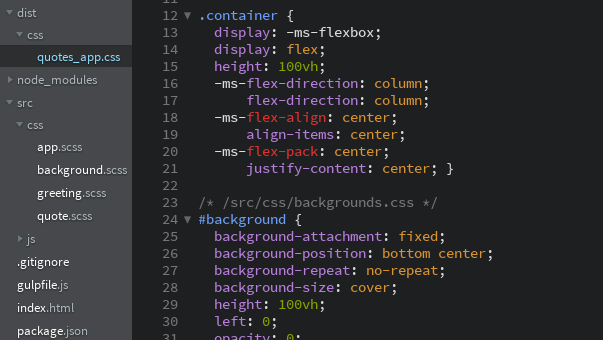

#Writing Modular JavaScript  -  Pt 3

This is part 3 of a series on writing modular JavaScript applications. [Part 1](https://medium.com/@jrschwane/writing-modular-javascript-pt-1-b42a3bd23685) explained why modularity is desirable and presented a simple modular application design structure. In [part 2](https://medium.com/@jrschwane/writing-modular-javascript-pt-2-d7140d15c982), we built a simple modular application based on those principles. In this concluding article we will prepare our files for deployment.


###Introduction

When we concluded part 2, we had a working modular web application.  We wrote our main our modules and their stylesheets as separate files, linked together in our `index.html` and main `app.js`. This is an efficient and scalable development process for all the reasons discussed in the previous two articles.

But eight separate files (not including our font and jQuery) means our browser has to make eight separate http requests to fetch our application's files. Although browsers make requests in parallel and even though our files not large, in a larger project the cumulative latency of all those requests will delay our application's load time. We should always strive to increase performance, especially when it can be achieved with minimal effort.

We can further decrease load times through [minification](https://en.wikipedia.org/wiki/Minification_(programming). Minification is a form of compression where function and variable names are replaced with smaller characters, and comments, whitespace and line breaks are removed. This results in smaller file sizes, which results in quicker load times for clients.

The demo application's code includes a feature of es6: [template literals](https://developer.mozilla.org/en-US/docs/Web/JavaScript/Reference/Template_literals).  Template literals are very useful, but their delimiting backticks can cause problems for some minifiers. To work around this problem, we need to [transpile](https://en.wikipedia.org/wiki/Source-to-source_compiler) our code from es6 to regular every-browser-understands-it es5 JavaScript.

Finally, we are going to pretend that we wrote SASS instead of CSS. We're not going to actually write SASS - we're just going to rename our `.css` files to `.scss`. Browsers do not natively understand `.scss` files, so we need a way to transpile those as well. While we're at it, we should probably add all the selector vendor prefixes so different browsers behave as expected.

We will use [Gulp](http://gulpjs.com/) to solve each of the above problems.  This article describes an easy way to add Gulp to your workflow. We will cover concatenation (merging files together), minification (a form of code compression) and transpilation (translating one language or syntax to another). Gulp will process our source files, renaming and outputting them to a destination directory of our choosing.

###Node.js and NPM

This is also not a detailed tutorial on [Node.js](https://nodejs.org/en/) - [many resources exist](https://scotch.io/tag/node-js) that can do a more thorough job than I can. I assume you know what Node and NPM (the Node Package Manager) are and have them installed locally.  If you do not, please see the [official docs](https://nodejs.org/en/download/package-manager/).  We will only use two Node-specific features: `require` and `pipe`. The rest of our Gulp code will be regular JavaScript. We will, however, spend most of our time in the command line.

###Application Structure

When we wrapped up part 2 we were looking at this file/folder structure:

```
|-- /src
|    |
|    |— /css
|    |    |
|    |    |-- app.css
|    |    |-- background.css
|    |    |-- greeting.css
|    |    |-- quote.css
|    |
|    |-- /js
|    |    |
|    |    |-- app.js
|    |    |-- background.js
|    |    |-- greeting.js
|    |    |-- quote.js
|
| index.html
```

###Initialization

Before we can install and use Gulp, we need NPM to initialize our project. Open a terminal, navigate to your project's root directory and enter the following command:

`$ npm init -y`

If you omit the `-y` flag, NPM will ask you a series of questions about your project. The the `-y` flag accepts all the default answers to those questions. A new file has been created in your project's root directory: `package.json`. It lists several properties of your application (all based on the answers to `npm init`'s questions). We will not need to edit this file manually.


###Gulp

Gulp is a Node.js _task runner_.  It can perform a wide variety of tasks by itself, but will need to install some plugins to enable Gulp to do the work we need.  Gulp installs using NPM and is run from terminal commands.

There are three phases to installing Gulp. We install the global module first, then a local per-project module, and finally any plugin modules we need.  If you get errors installing Gulp globally, you may need to elevate your user priviledges. For example, in a Debian/Ubuntu environment you need to preface the installation command with `sudo`.  You do not need elevated priviledges to install the local Gulp package or any of the plugins we will be using.

Install Gulp globally first:

`$ sudo npm install gulp-cli -g`

The `-g` flag instrcuts NPM to install the package globally - it will be available to use in any other file/folder path on your computer. Once that has finished, install Gulp locally. Make sure you are still in your demo project's root folder, and issue the following command:

`$ npm install gulp --save-dev`

The `--save-dev` command-line switch tells NPM to register the package as a _developer dependency_ in `package.json`.  We will use that switch when installing all of the Gulp plugins as well.

If you open `package.json` now, you'll find that NPM has added a new `"devDependencies" : {...}` property with "gulp" listed as its sole dependency. All of our plugins will be registered here as we install them.  Let's do that now.

We need the following plugins:

1.  [gulp-concat](https://www.npmjs.com/package/gulp-concat) - to merge our separate JavaScript and SASS files together

2.  [gulp-sass](https://www.npmjs.com/package/gulp-sass) - to convert our `.scss` files into traditional `.css` files

3.  [gulp-autoprefixer](https://www.npmjs.com/package/gulp-autoprefixer) - to automatically add vendor-prefixed selectors to our stylesheets based on [CanIUse](http://caniuse.com/) rules

4.  [gulp-babel](https://www.npmjs.com/package/gulp-babel) - Babel will transpile any es6 syntax into traditional es5 JavaScript

5.  [babel-preset-es2015](https://www.npmjs.com/package/babel-preset-es2015) - gives us a Babel configuration object

5.  [gulp-sourcemaps](https://www.npmjs.com/package/gulp-sourcemaps) - to generate a JavaScript [sourcemap](https://www.html5rocks.com/en/tutorials/developertools/sourcemaps/) so that when we're debugging we can make sense of the browser's console output

6.  [gulp-uglify](https://www.npmjs.com/package/gulp-uglify) - to minify our JavaScript: remove whitespace, comments and line breaks, and rename  variable and function names with shorter characters

We install these plugins using NPM, again using the `--save-dev` switch to add each module to `package.json`. You can install them individually or all at once:

`$ npm install gulp-concat gulp-sass gulp-autoprefixer gulp-babel babel-preset-es2015 gulp-sourcemaps gulp-uglify --save-dev`

Gulp now has everything it needs to process our JavaScript and SASS files.  You may have noticed the new `node_modules` folder created in your root directory. That's where NPM stores all the files required by our dependencies. We will not need to do anything in `node_modules`.

If you use Git for version control, now would be a good time to add `node_modules/` to your `.gitignore` file.  Since we do not manage anything in `node_modules`, there's no reason for us to track or push those files to a remote repository. Should they be deleted, we can easily recreate everything inside `node_modules` with a single `npm install` command.

Our `"devDependencies"` object should now look like this (version numbers current as of publication date):

```javascript
"devDependencies": {
    "babel-preset-es2015": "^6.22.0",
    "gulp": "^3.9.1",
    "gulp-autoprefixer": "^3.1.1",
    "gulp-babel": "^6.1.2",
    "gulp-concat": "^2.6.1",
    "gulp-sass": "^3.1.0",
    "gulp-sourcemaps": "^2.4.1",
    "gulp-uglify": "^2.1.0"
}
```

Our directory structure now looks like this:

```
|-- /src
|    |
|    |— /css
|    |    |
|    |    |-- app.css
|    |    |-- background.css
|    |    |-- greeting.css
|    |    |-- quote.css
|    |
|    |-- /js
|    |    |
|    |    |-- app.js
|    |    |-- background.js
|    |    |-- greeting.js
|    |    |-- quote.js
|
|-- /node_modules
|
| .gitignore
| index.html
| package.json
```

Now let's put Gulp to work.

###Processing CSS

We are going to use Gulp to process our separate stylesheets, converting SASS to CSS, adding necessary vendor prefixed selectors and outputting the result as a single file. But we don't technically have any SASS. Lucky for us, traditional CSS is also valid SASS, so we can fake it by just renaming the file extensions. In our project's `/src/css/` folder, rename all the `.css` files to `.scss`:

```
|-- /src
     |
     |— /css
          |
          |-- app.scss
          |-- background.scss
          |-- greeting.scss
          |-- quote.scss
```

**Et voilà: _SASS!_**

But we still need to tell Gulp to do the work, and that means we need a `gulpfile.js`.  Create one in your root project directory and begin be requiring all of our plugin modules:

```javascript
/* gulpfile.js */

var gulp         = require('gulp'),
    concat       = require('gulp-concat'),
    sass         = require('gulp-sass'),
    autoprefixer = require('gulp-autoprefixer'),
    sourcemaps   = require('gulp-sourcemaps'),
    uglify       = require('gulp-uglify'),
    babel        = require('gulp-babel');
```

Remember: Gulp is a _task runner_ -  we need to give it a **task** before it will work for us.  Gulp tasks are pretty simple - they are a method that accepts two arguments: the task's name (as a strgin) and a callback function that does all the actual work:

```javascript
// example
gulp.task('taskName', function () {
    // do stuff
});

```

Let's add a `styles` task to our `gulpfile.js`. Add the task after the opening list of required modules:

```javascript
/* gulpfile.js */

var gulp         = require('gulp'),
    concat       = require('gulp-concat'),
    sass         = require('gulp-sass'),
    autoprefixer = require('gulp-autoprefixer'),
    sourcemaps   = require('gulp-sourcemaps'),
    uglify       = require('gulp-uglify'),
    babel        = require('gulp-babel');
    

// process stylesheets
gulp.task('styles', function () {

    gulp.src('src/css/**/*.scss')
        .pipe(concat('quote-app.scss'))
        .pipe(sass().on('error', sass.logError))
        .pipe(autoprefixer({
            browsers: ['last 2 versions']  // config object
        }))
        .pipe(gulp.dest('dist/css'));

});
```

Inside the callback, `gulp.src()` expects the location of our `.scss` files a string.  The wildcard `/**/` instructs Gulp to look into subfolders for any `.scss` files to process.  Then we `.pipe()` those files through each of our plugins (the arguments passed to `.pipe()`), processing them at each step:

1.  The separate `.scss` files are first concatenated into a single `quote-app.scss` file
2.  then the merged `.scss` file is converted to a standard `.css` file
3.  then vendor-prefixed selectors are added based on the config object (our config object targets the most recent two versions of all browsers)
4.  finally, the resulting CSS file is written to `/dist/css/` (Gulp will create the folder if it doesn't exist)

Task #1: _done_. Now run it from your terminal:

`$ gulp styles`


Take a look at the new `/dist/css/quote-app.css` - the output of our Gulp task. All of our separate `.scss` files were merged, converted to `.css` and vendor-prefixed (specifically the _flexbox_ properties):



In `index.html`, we can replace the separate links to our original four `/src/css/` files with a single `<link>` aimed at our new `/dist/css/quote-app.css`:

```html
    <!-- ===================== css ====================== -->
    <link rel="stylesheet" href="dist/css/quote-app.css">
```

That takes care of our stylesheets. If you make changes to our source `/src/css` files, those changes will not propagate to our production `/dist/css/quote-app.css` unless we re-run `gulp styles`.  That's annoying; we'll learn how to automate this process after we deal with our JavaScript.

###Processing JavaScript

Before we create a new task to process our modular JavaScript files, we need to address a potential issue with `gulp-concat`. Above we used `gulp.src('src/css/**/*.scss')` to grab any and all SASS files found in `src/css` and its subfolders. That isn't an issue with CSS because selector order doesn't matter - especially since our module selectors are namespaced to their modules. But order is critical to our modules' JavaScript files - **our modules need to be initialized first** so that `app.js` can call their public methods. We can force a specific file order using an array of our source file names. We'll pass this array to `gulp.src()` instead of a file path and wildcard. Add the array below our other variable declarations:

```javascript
/* gulpfile.js */

var gulp         = require('gulp'),
    concat       = require('gulp-concat'),
    sass         = require('gulp-sass'),
    autoprefixer = require('gulp-autoprefixer'),
    sourcemaps   = require('gulp-sourcemaps'),
    uglify       = require('gulp-uglify'),
    babel        = require('gulp-babel');
    
// ordered array of javascript source files
var sourceJS = [
    'src/js/background.js',
    'src/js/greeting.js',
    'src/js/quote.js',
    'src/js/app.js'        // must come last!
];    
```

Now add a `scripts` task beneath our existing `styles` task to process our JavaScript:

```javascript
/* ... snip ... */

// process scripts
gulp.task('scripts', function () {
    gulp.src(sourceJS)
        .pipe(sourcemaps.init())
        .pipe(concat('quote-app.min.js'))
        .pipe(babel({
            presets: ['es2015']  // babel config object
        }))
        .pipe(uglify())
        .pipe(sourcemaps.write())
        .pipe(gulp.dest('dist/js'));
});
```

In the above task, after passing our array of source files to `gulp.src` we `.pipe()` them from one plugin to the next, just like we did in our `styles` task. Summarizing:

1.  We first initialize the `sourcemaps` plugin
2.  then we concatenate our srparate files into a single `'quote-app.min.js'` file
3.  then transpile the merged file, converting any es6 (aka es2015) syntax to traditional es5 syntax using our Babel preset
4.  then we minify the merged and transpiled code
5.  then we append the sourcemap the the end of our Javascript
6.  and finally we output the processed file to `/dist/js/`

Task #2: _done_. Now run it from your terminal:

`$ gulp scripts`


Open newly-created `/dist/js/quote-app.min.js` in your editor to see the effect of `uglify`:


That illegible mess on line 1 is functionally equivalent to all of our source code. And if you think that's funky, _look at line 2_ - that's the sourcemap.

We can now replace the separate links to our application and module files with a single `<script>` tag:

```html
<!-- ================ our javascript ================== -->
<script src="dist/js/quote-app.min.js"></script>
```

> You may have noticed that the total size of our four original files (5.3kB) is actually _less_ than our processed and minified `quote-app.min.js` (12.3kB). That seems wrong - what's going on? Our minified file grew in size because we appended the sourcemap to it. If we omit `sourcemaps`, our task produces a 1.6kB file.

###Watching Files for Changes

As mentioned previously, manually re-running Gulp tasks after each minor code change adds an annoying interruption to our workflow. Gulp is supposed to make life easier. This section will introduce one of Gulp's greatest features: **watchers**. A watcher can automatically run tasks in response to specific events. We will write a watcher that _watches_ our source `.scss` files for changes, and in response runs our `styles` task.

But first we have to create a new _default_ task (unsurprisingly called `default`) to contain our watcher.  Add a new task after our `scripts` task: 

```javascript
// default task contains our watcher
gulp.task('default', ['styles'], function() {
    
    // watch source sass files and convert ono changes
    gulp.watch('src/css/**/*.scss', ['styles']);

});
```

This task is constructed a little differently than our previous tasks. Notice the additional array we pass to `.task()` as its second argument - think of that as a list of the tasks we'll be using inside this one. We write our watcher inside the `default` task's callback using `gulp.watch()`. We pass two arguments to `.watch()`: the path of the files we watch to watch as a string, and an array of tasks to run when they change. 

Gulp `default` tasks can be exectued by just typing `gulp` - you do not need to use the task's name. Because it initiates a watcher, when we run the `default` task it executes but doesn't terminate - it stays running in our terminal because it's watching for additional changes to our files:


So let's change something.  Currently, our quote text turns red (`color: #F33`) on hover - change try a light grey blue instead. Make the following change to `/src/css/quote.scss`:

```css
/* /src/css/quote.scss */

#quote > a:hover {
    color: #AAF;
}
```

Save the file and watch your terminal window you'll see Gulp re-run our `styles` task in response to the changed file. Our `styles` task will have generated a brand new `/dist/css/quote-app.css`, so our change is live - reload your browser window:


Instant production-ready CSS and no more work-flow interruption.

###Summarizing

At the end of [part 2](https://medium.com/@jrschwane/writing-modular-javascript-pt-2-d7140d15c982), we had a perfectly functional modular application.  We could have left it at that; we had achieved our design goals after all.  But in the process, we introduced the potential for degraded performance: the browser has to make separate requests for all our modular files, which could negatively affect page load times.

Forseeing that problem, we used Gulp to process our source files and generate production-ready files in preparation for deployment.  We added vendor-prefixed selectors to our CSS, and concatenated, transpiled and minified our source files. Finally, we added a watcher so that we wouldn't need to manually rerun our tasks each time we made a change to our source stylesheets.

#Conclusion

This wraps up this series on writing modular JavaScript. It presents one method for planning and building modular applications that is easy to understand and implement, and does not require any exotic libraries or frameworks. This makes it well-suited for beginning JavaScript programmers.

You might ask, "why _not_ use a framework?"  It's a fair question -  Angular for example, is modular by design. I have nothing against frameworks (I **love** Angular), but time is precious. The modular structure described in parts 1 and 2 of this series can be used by anyone - it does not require that you first gain proficiency with a framework's syntax and methods. And thinking in terms of modular application design _now_ will help you understand the 'why and how' of frameworks like Angular _later_.

Ultimately, _modular design_ is more foundational and theoretical; framework or no framework, the applications you build on top of that foundation will benefit from thinking in terms of modules.  Hopefull you can repurpose these ideas in your own projects.

In the mean time, enjoy the endless stream of mint juleps headed your way.
